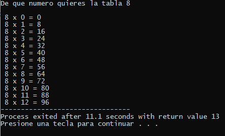

# PROGRAMA DE TABLAS DE MULTIPLICAR

Se te pedira que ingreses un numero

El numero ingresado sera la tabla de multiplicar que desea

Una vez ingresado el numero presionaras la tecla INTRO

Se mostrara la tabla de multiplicar que requeriste

Ejemplo:

