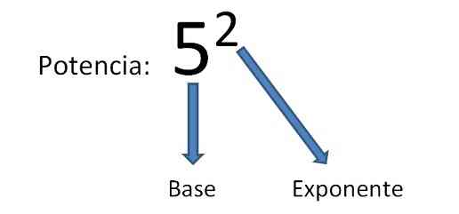
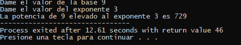

# PROGRAMA QUE CALCULA POTENCIAS

Se te pedira primero que ingrese la base del numero a calcular la potencia.

Una vez ingresado la base presionara INTRO.

Se te pedira primero que ingreses la potencia de la base.

Una vez ingresada la potencia presionaras INTRO.

Se mostrara el resultado de la potencia

Ejemplo:

